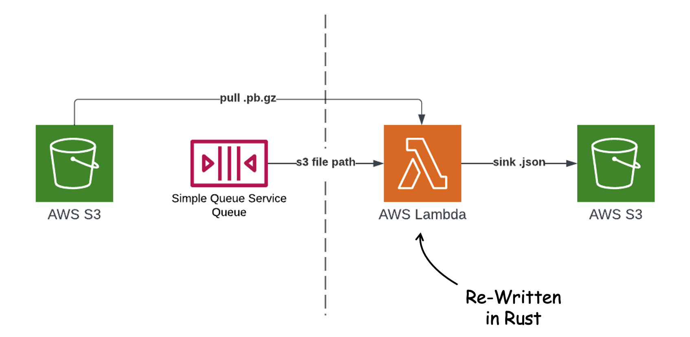
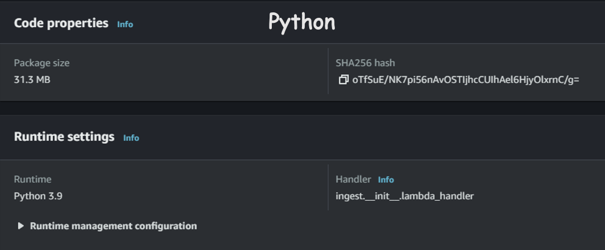
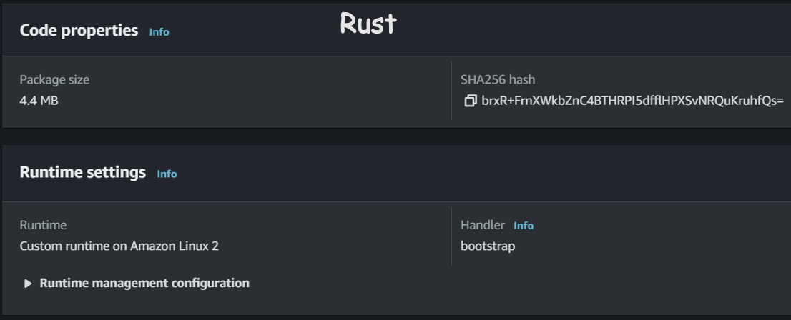
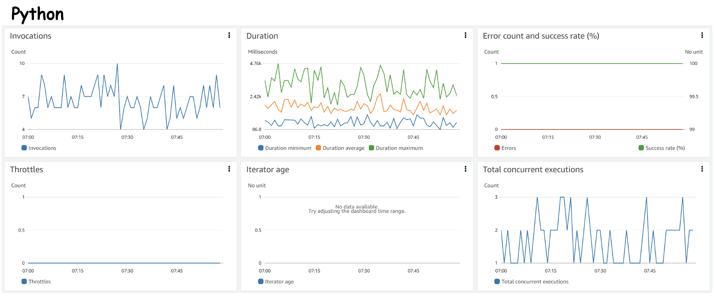
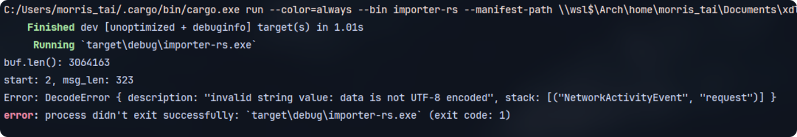

<link rel="stylesheet" href="https://cdn.jsdelivr.net/npm/katex@0.16.2/dist/katex.min.css" integrity="sha384-bYdxxUwYipFNohQlHt0bjN/LCpueqWz13HufFEV1SUatKs1cm4L6fFgCi1jT643X" crossorigin="anonymous">


I've recently been working on rewriting our small service with Rust for fun. One reason is to see if Rust, as a system programming language, is ready for cloud development in 2023. Another reason is that I wonder how much better it is compared to Python or Java in major cloud and data computing. 


> 💡 There is a lot of discussion over which language to use as a serverless service. In my point of view, dynamic languages like Python lack compile-time checks, which can cause more runtime errors than static languages like Rust or Java.  
> Another reason is that Python and Java need a runtime process (JVM, CPython) to run your actual code, which means they can't run natively like compiled Rust does. However, I'm not sure about the performance gap. Furthermore, Rust doesn't require garbage collection, so ideally, a program's heap size should fluctuate less than a garbage-collected language when running. That means Lambda or Function underlying infrastructure controller should be able to handle invocation or scaling more easily.  
> In terms of language paradigms, in my opinion, compared to traditional OOP, the modern [ML (meta-language) family](https://en.wikipedia.org/wiki/ML_%2528programming_language%2529) has a better design for scalable cloud services.


## Working Protobuf with Prost


Here's a diagram showing the simplified architecture of one of our Lambda services.





In order to do that, I have to research Rust libraries that bring additional functionality to existing services, such as asynchronous ecosystems, Protocol Buffers, and cloud SDKs. Luckily, I found that the Rust community has been quite serious about porting Rust to the cloud, especially for AWS. Some examples include:

- [AWS Rust SDK](https://github.com/awslabs/aws-sdk-rust) (although it's still in the preview stage)
- [Cargo Lambda](https://github.com/cargo-lambda/cargo-lambda) (which even uses [Zig for cross compiling linker](https://github.com/rust-cross/cargo-zigbuild))
- [Prost](https://github.com/tokio-rs/prost) (Protocol Buffers implementation for Rust)
- [aws-lambda-rust-runtime](https://github.com/awslabs/aws-lambda-rust-runtime) (For you to run Rust application on Lambda)
- [Mountpoint S3](https://github.com/awslabs/mountpoint-s3) (mounting S3 bucket as a local file system)

These crates provide a great development experience when writing cloud services. However, after trying some of them, I found that there are still some features that need to be added or other inconvenient parts. For example, Prost is heavily based on tonic. So if you only want to use Prost without tonic, you may want to use a tool like [proto-gen (made by Embark Studios)](https://github.com/EmbarkStudios/proto-gen), which provides a feature-rich CLI over Prost.


> 💡 To understand how Protocol Buffers (protobuf) works under the hood, I recommend reading this article: [Protobufs Explained. In essence Protocol Buffers, aka… | by Giga Gatenashvili](https://levelup.gitconnected.com/protobufs-explained-17ed6ba52076)


Let’s look at our makefile for generating Rust code using `*.proto`


```makefile
RUST_GENERATOR_FOLDER = ../submodules/proto-gen-rs
PROTO_FOLDER = ../common-schema/proto # This is where *.proto files are located
GENERATED_FOLDER = ../../rust/src # destination for generated Rust files

# If want to add serde attributes to generated files
# --type-attribute '.=#[derive(Serialize)] #[serde(rename_all = \"snake_case\")]'

.PHONY: generate_all
generate_all:
	cd $(RUST_GENERATOR_FOLDER); \
	cargo r -r -p proto-gen -- generate -d $(PROTO_FOLDER) -f $(PROTO_FOLDER)/wrapper.proto -o $(GENERATED_FOLDER)/proto_types
```


Prost also support [Protobuf well-known types](https://protobuf.dev/reference/protobuf/google.protobuf/). But it come with a seperate crate.


```toml
# If you want to use Protobuf well-known types, you have to add following to Cargo.toml
prost-types = "0.11"
```


Once Rust structs been generated, we can use them to decode the corresponding schema like this:


```rust
use bytes::Bytes;
use schema::proto_types::YourEventType;
use flate2::read::GzDecoder;
use prost::{DecodeError, Message};

pub fn decode_proto_byte(bytes: Bytes) -> Result<YourEventType, DecodeError> {
    let msg = YourEventType::decode(bytes)?;
    Ok(msg)
}

// If the data is compressed with .gz we can ready it to Bytes stream
pub fn decompress_gz(data: Bytes) -> Result<Bytes, std::io::Error> {
    let mut decoder = GzDecoder::new(&data[..]);
    let mut buffer = Vec::new();
    decoder.read_to_end(&mut buffer)?;
    Ok(Bytes::from(buffer))
}
```


> 💡 However, I have not yet tried it with a length-delimited `.proto` file. I will update here once I get it to work.


## SDK for AWS Lambda


Once we can handle the Protobuf file, we can start porting to the cloud and test the data digest flow. Here, we use Tokio and the AWS Rust SDK to build our small consumer service. You can see that we use the [crate `AWS_Lambda_Events`](https://crates.io/crates/aws_lambda_events) to help us use our `SqsEvent` more easily.


```rust
async fn function_handler(event: LambdaEvent<SqsEvent>) -> Result<(), Error> {
    debug!("SqsEvent: {:?}", &event);
    let mut s3_entity_list: Vec<S3Entity> = Vec::new();
    for record in event.payload.records {
        if let Some(body) = record.body {
            let sqs_message: SqsMessage = serde_json::from_str(&*body)?;
            if let Some(s3) = sqs_message.s3 {
                s3_entity_list.push(s3.clone());
            }
        } else {
            return Err(Error::from(format!("s3 event not found in event payload or invalid format! record: {:?}", record)));
        }
    }
```


Once we receive an SQS event that records a Protobuf file located in an S3 bucket, we can start consuming them.


```rust
let mut event_list: Vec<YourEventType> = Vec::new();
for bytes in bytes_list {
    let decompressed_bytes = decoder::decompress_gz(bytes)?;
    let msg = decoder::decode_proto_byte(decompressed_bytes)?;
    debug!("Event: {:?}", &msg);
    event_list.push(msg);
}
```


Finally, decode it into JSON format and send it to the landing bucket.


```rust
let mut event_list: Vec<YourEventType> = Vec::new();
for bytes in bytes_list {
    let decompressed_bytes = decoder::decompress_gz(bytes)?;
    let msg = decoder::decode_proto_byte(decompressed_bytes)?;
    event_list.push(msg);
}
info!("protobuf file decoded successfully, {} events found", event_list.len());

let mut json_string_list: Vec<String> = Vec::new();
for event in event_list {
    let json_str = serde_json::to_string(&event)?;
    json_string_list.push(json_str);
}
let flattened_json_string = Bytes::from(json_string_list.join("\n"));
let random_object_key = format!("{} {}", Uuid::new_v4().to_string(), ".json");
s3_controller::put_object(client.clone(), LANDING_BUCKET_NAME, random_object_key, flattened_json_string).await?;
info!("Put object to landing-bucket successfully");
```


## Evaluation 


Once we have completed our Lambda code and tested it successfully using LocalStack, we will deploy it to our cloud. Thanks to Cargo Lambda, the deployment experience has been really smooth.


> 💡 Since Lambda does not officially support the Rust runtime yet, we need to use a custom runtime on AWS Linux 2. Fortunately, there is already a pre-built runtime for Rust published by AWS, which can be found at [here](https://github.com/awslabs/aws-lambda-rust-runtime).


### Package Size


Here, we compared our Rust application to the Python application, and the size is about 7 times smaller in Rust.


> 💡 Disclaimer: The Lambda function has not fully implemented all of our existing functions, and the testing scenario is not rigorous.

<div style="display:flex;">
  
  
</div>

### Performance


The performance difference between the Rust and Python applications is about 8 times faster, although there are some duration spikes in Rust. I think this might be due to the Rust runtime not yet being stable in the Lambda environment. However, this is just a rough test, and no serious stress test has been applied.





## Take Away


After experimenting with Rust on AWS Lambda, I found the development experience to be quite impressive. Since most of our cloud applications are I/O-bound, async plays a significant role in implementing a well-performing service. As the Rust ecosystem continues to mature and adopt async (although we still need the async trait macro for now), the possibility of Rust cloud applications becomes more feasible. However, this demo is just a simple function that performs a basic task. If Rust wants to be widely adopted for data streaming or backend deployment, it needs more SDK support. Currently, I have only seen AWS attempt to make Rust a viable option on their end, and it is still in the preview stage. Therefore, there is still a long way to go.


## TODO


After failing with Prost decode with length-delimited proto file, I will try to debug it after we upgrade our schema from proto2 to proto3 and see if there is a bug inside our schema or if it's a file format error. (Since Python can successfully decode, I think there might be a bug inside the Prost crate, but I'm not sure.)




