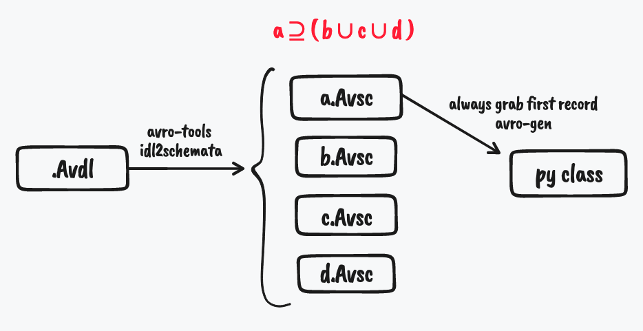
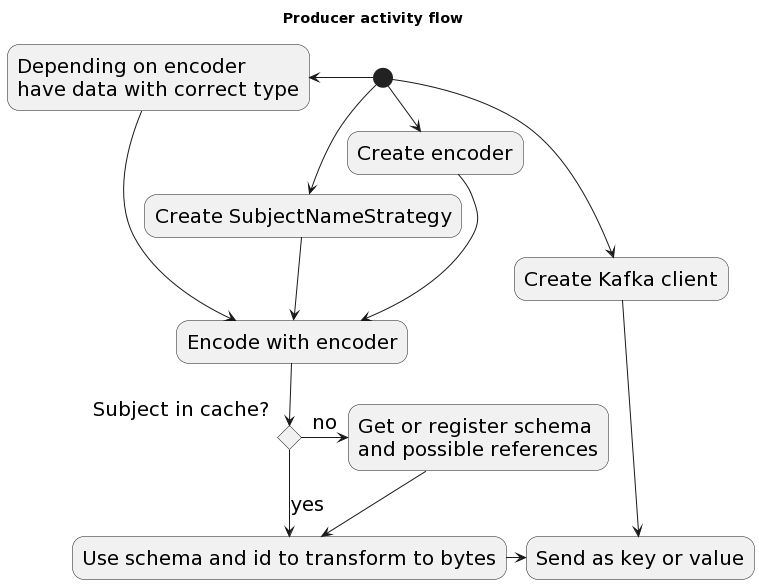
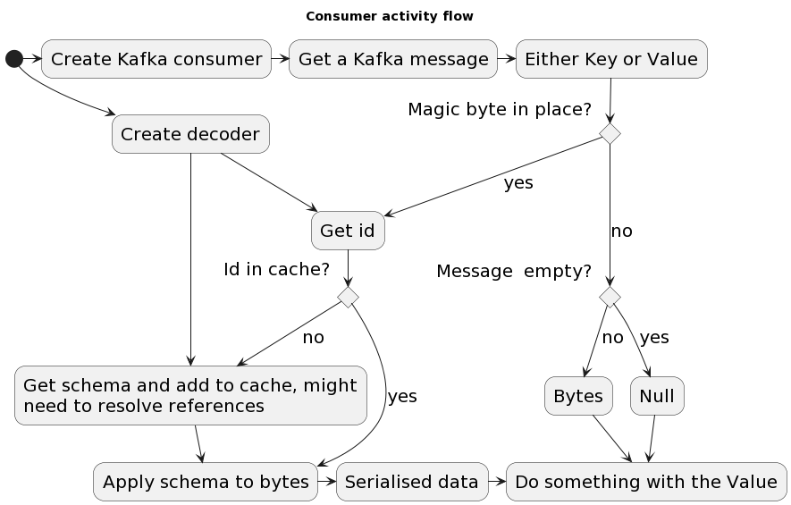
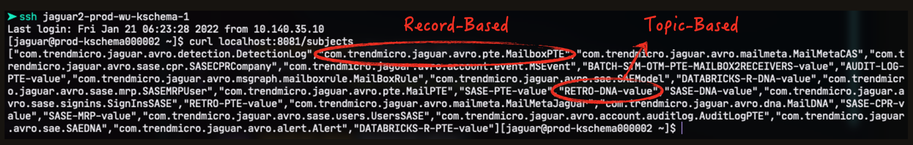
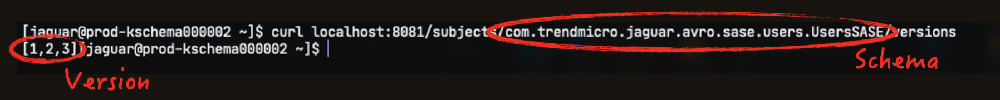
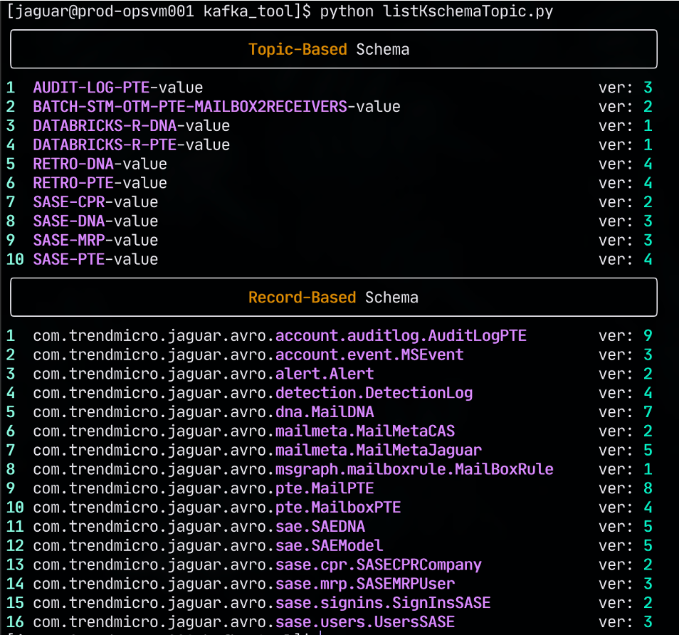

TL;DR: You can find the script on my GitHub repository: [kschema-table](https://github.com/morristai/kschema-table)

## Coordinating schema with Data Scientist

As a data engineer, you'll need to collaborate closely with data scientists/domain experts to design data schemas. The optimal schema will depend heavily on the business domain and how the product is used. For instance, in a cybersecurity context, threat experts and data scientists would likely be the ones designing the data schema. They may work with infrastructure and data teams to define these schemas in a common format like, for example: Avro IDL (Avro Interface Description Language).

> Why Avro?
> [Apache Avro](https://avro.apache.org/) is a popular choice for serializing data in [Kafka](https://kafka.apache.org). Avro is a data serialization system that provides rich data structures and a compact, fast, binary data format. [To learn more: Comparison of different file formats in Big Data](https://www.adaltas.com/en/2020/07/23/benchmark-study-of-different-file-format/)

Here's an example of an Avro `.avdl` schema:

```avdl
@namespace("org.example.avro")
protocol UserProfile {

  /** A basic user record **/
  record User {
    string   username;   
    int      age;        
    boolean  isActive;   
    float    signupScore;
  }
}
```

But the `.avdl` format can't be directly used in Schema Registry. We can convert the `avdl` schema into the `.avsc` format and register it with the Kafka Schema Registry. An `.avsc` schema is a JSON representation of an Avro schema but in a simpler expression. Here's a basic example:

> P.S. Avro officially provides a CLI tool called [avro-tools](https://formulae.brew.sh/formula/avro-tools) to convert Avro IDL schemas to Avro schemas.

```json
{
  "type": "record",
  "name": "User",
  "namespace": "org.example.avro",
  "fields": [
    {"name": "username", "type": "string"},
    {"name": "age", "type": "int"},
    {"name": "isActive", "type": "boolean"},
    {"name": "signupScore", "type": "float"}
  ]
}
```

However, Real-world schemas often involve nested records, arrays, enums, etc.  A single `.avdl` file might generate multiple `.avsc` files to represent these complex structures.

To ease the work of both the data team and the infrastructure team, we can further generate Python classes from the `.avsc` files to provide structure for your codebase. This allows data scientists to work directly with data objects when building models or writing scripts in frameworks like PySpark, TensorFlow, etc. (I've written a Scala project to generate PySpark objects from Avro schema, but that will be another post.)



## Working with Kafka Schema Registry

When using Avro with Kafka, you need to manage the schema of your data. The schema defines the structure of your data, including the fields and their types. The schema is used to serialize and deserialize your data, so it is important that the schema is consistent between the producer and the consumer.
Here's the detailed flow of how Kafka Schema Registry works:

Ref: [Kafka Client flow chart](https://github.com/gklijs/schema_registry_converter)

<div style="display:flex;">
  
  
</div>

In an ideal scenario, data scientists and data engineers would collaborate seamlessly on a consistent schema throughout the entire data pipeline. However, in practice, schemas can evolve over time. It's crucial to track and manage these changes effectively.

## Record-Based Schema vs. Topic-Based Schema

Things get a bit more complicated when you have multiple producers and consumers writing and reading from the same topic. There are two ways to manage the schema in this case: record-based schema and topic-based schema.

For example, our team uses Java Spring Boot to produce and consume messages from Kafka. These microservices take `.avdl` files directly and transfer them into Java objects through the Gradle plugin. With this method, it employs a **record-based** schema. This means that each message contains the schema itself, ensuring consistency across all messages in the topic.

However, data scientists who use Python to consume messages from Kafka may not want to deal with the schema in each message. They may prefer to use a **topic-based** schema, where the schema is only stored in the Kafka Schema Registry. The producer and consumer then use the schema from the registry to serialize and deserialize the messages.

Here's a comparison of record-based schema and topic-based schema:

| Kind | Record-Based Schema | Topic-Based Schema |
|---|---|---|
| Schema Association | Schema tied to the individual record (message) within a topic. | Schema tied to the entire topic. |
| Granularity | Fine-grained control over schema evolution of individual records. | Less flexible, schema changes affect all records within a topic. |
| Compatibility Checks | Can enforce compatibility at the record level. | Can enforce compatibility at the topic level. |
| Use Cases | Ideal for scenarios where messages within a topic may have different structures or evolve independently. | Suited for cases where all messages within a topic share a common structure and schema changes are less frequent. |

## Making Schema Operations Easier

While working on a project, I discovered that managing schemas in the Kafka Schema Registry can be a bit cumbersome. You need to use the Kafka Schema Registry API to register, list, and retrieve schemas. The free version of Kafka Schema Registry will return all schemas in the registry, which can be overwhelming if you have multiple schemas for each topic. Additionally, if you want to determine the latest version of a schema, you need to retrieve all versions of that specific schema and then identify the latest version.

(Example: List all schemas in the registry)


(Example: Retrieve all versions of a schema)


So, I wrote a Python script to make it easier to manage schemas in Kafka Schema Registry. The script uses the HTTP API of Kafka Schema Registry to register, list, and retrieve schemas. It also summarizes the schemas in a rich table format, allowing you to easily view the schema based on its type and latest version.

(Example output: List all schemas in the registry)

